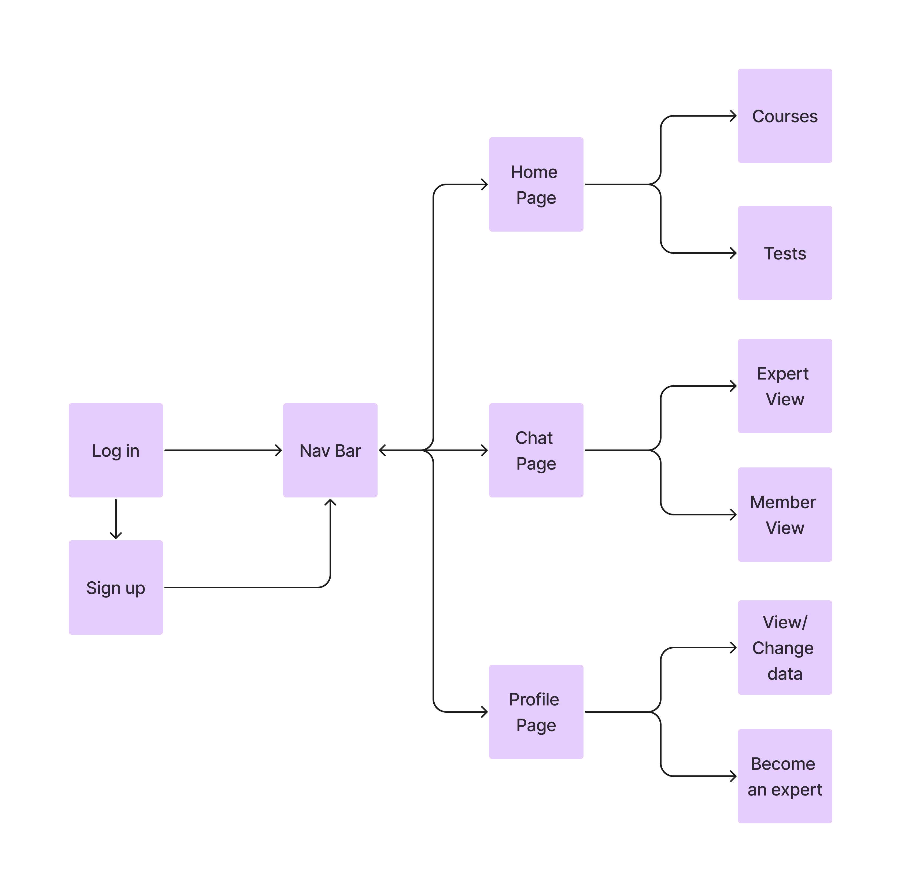

# MasterMove

    

## What is MasterMove

MasterMove is a mobile app designed to educate users on various topics (hobbies) and connect them with experts on the subject and other users, all in an interactive and fun way. Whether you want to become proficient in chess, master a new musical instrument, or perfect your photography skills,  MasterMove can be of help.

## Features

- Courses with video 
- Interactive tests
- Level-up system
- Chat page (users can text experts & each other)

## Structure

## Technologies used
- Flutter
- Dart
- Firebase

## Video Demo
https://drive.google.com/file/d/1b4vKiV4kqucOrgFLukDN4Bv0KLfVViwz/view?usp=drive_link
